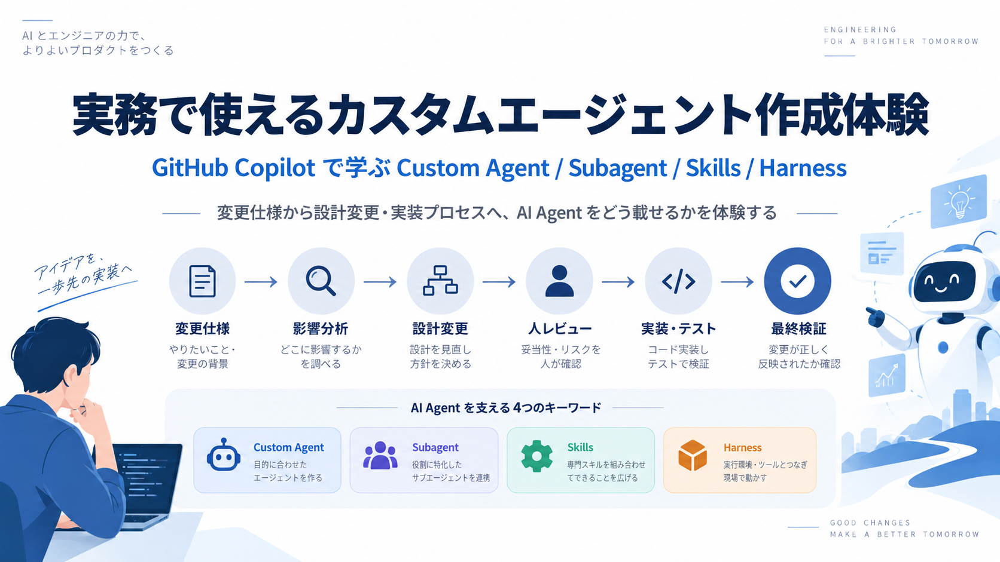
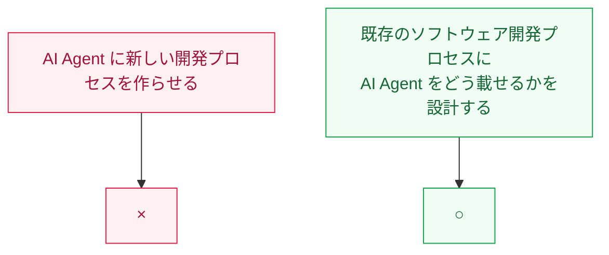
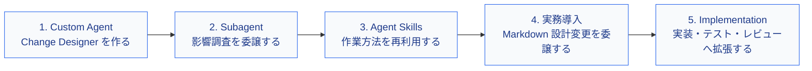
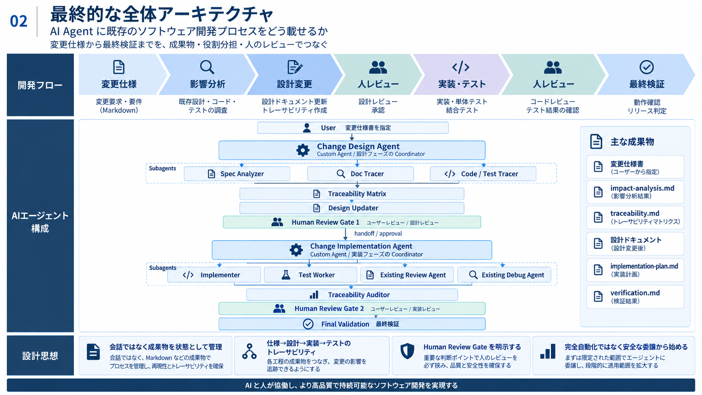
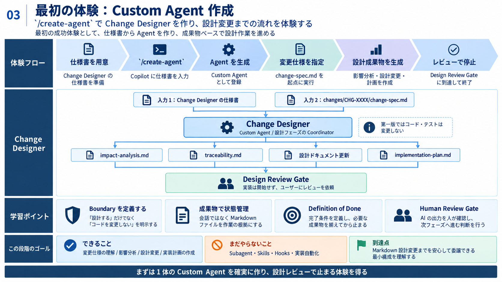
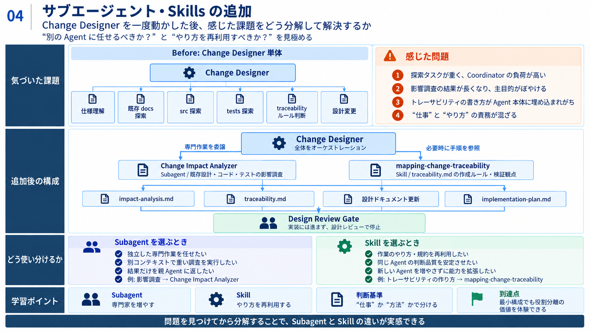
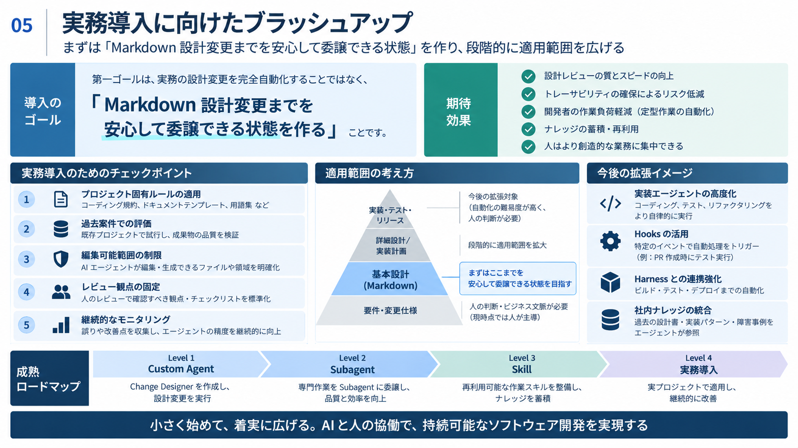

<!--
---
number: 006
id: copilot-custom-agent-learnkit
slug: copilot-custom-agent-learnkit

title: "Modern C++ Template LearnKit"

subtitle_ja: "Modern C++学習用プロジェクトテンプレート"
subtitle_en: "Modern C++ Project Template for Learning"

description_ja: "C++17プロジェクトの環境構築を自動化し、テスト・静的解析・メモリチェック・カバレッジ測定・ドキュメント生成を最初から利用できる学習支援テンプレート"
description_en: "Automated project setup for C++17 with built-in testing, static analysis, memory checking, coverage measurement, and documentation generation"

category_ja:
  - GitHub Copilot
category_en:
  - GitHub Copilot

difficulty: 2

tags:
  - github-copilot

repo_url: "https://github.com/sumimi/copilot-custom-agent-learnkit"
demo_url: ""

hub: true
---
-->

# Copilot Custom Agent LearnKit


GitHub Copilot の **Custom Agent・Subagent・Agent Skills・Harness** を、既存プロジェクトの変更開発を題材に実践的に学ぶためのハンズオン教材です。



この LearnKit では、いきなり完全自動化された AI 開発環境を作ることを目指しません。

まずは、

> **Markdown 形式の設計変更までを安心して AI Agent に委譲できる状態を作る**

ことを第一ゴールとします。

そこから Custom Agent、Subagent、Skills、Human Review Gate を段階的に追加し、最終的には **既存のソフトウェア開発プロセスそのものを AI Agent に載せる**ところまで発展させます。

---

## 🎯 この教材の目的

この教材では、単に「GitHub Copilot にコードを書かせる方法」を学ぶのではありません。

実際のソフトウェア開発プロセスを題材に、次の設計判断を体験します。

* Custom Agent にどこまで責務を持たせるか
* どの仕事を Subagent に分離するか
* どの作業方法を Skill として再利用するか
* Agent が利用できる Tool をどう制限するか
* Agent 間でどの成果物を受け渡すか
* Human Review をどこに置くか
* どこから自動化し、どこに人間の判断を残すか

目指すのは、



という考え方です。

---

## 👥 対象ユーザー

### 👨‍💻 主な対象：開発者

この教材は、GitHub Copilot を日常の開発で利用しており、次のステップとして Agent 活用を学びたい開発者を対象としています。

* GitHub Copilot Chat / Agent mode を利用したことがある
* AI にコード生成を依頼した経験がある
* Custom Agent に興味がある
* Subagent と Skills の違いを実際に体験したい
* AI Agent を実務の開発プロセスへ導入したい

### 👨‍🏫 副次的な対象

* AI 活用をチームへ展開するリーダー
* 開発プロセス改善を担当するエンジニア
* GitHub Copilot の社内教育・研修担当者

---

## 🚀 この教材で体験すること

この LearnKit は、完成済み Agent を使う教材ではありません。

小さな Agent から始め、実際に問題を感じ、それを改善しながら Agent Architecture を育てます。



---

# 🏗️ 1. 最終的に目指す Agent Architecture

この教材の最終到達点は、変更仕様から最終検証までを AI と人間が協働して進める開発プロセスです。




### 🧠 Agent Architecture の考え方

この構成では、巨大な Agent 1体ですべてを実行しません。

* **Custom Agent**：フェーズ全体を Coordinator として制御する
* **Subagent**：独立した専門作業を担当する
* **Skill**：再利用可能な作業方法・知識を提供する
* **Harness**：Agent、Model、Tool、Permission、Session を実行する
* **Human Review Gate**：重要な判断を人間へ戻す

---

## 📦 成果物を中心に Agent をつなぐ

Agent 間の状態をチャット履歴だけに持たせません。

変更単位で次の **Change Package** を管理します。

```text
changes/
└── CHG-0123/
    ├── change-spec.md
    ├── impact-analysis.md
    ├── traceability.md
    ├── implementation-plan.md
    └── verification.md
```

重要な考え方は、

> **会話ではなく、Git 管理された成果物を Single Source of Truth (SSOT) にする**

ことです。

---

# 🤖 2. 最初の体験：Custom Agent を作る


最初から複数の Agent や Skill を作りません。まずは **Change Designer ひとつだけ**を作ります。

この段階ではソースコードを変更しません。設計変更のみ実行するカスタムエージェントを作成します。



---

## 🛠️ Step 2-1: `/create-agent` を体験する

VS Code の Agent mode で、以下を実行します。

```text
/create-agent
```

続けて、本教材で用意した **Change Designer 仕様書**をそのまま入力します。

### 📋 Change Designer 仕様書

完全な仕様書は次を参照してください。

* [Change Designer 仕様書](docs/agent-specs/change-designer-agent-spec.md)

---

## ▶️ Step 2-2: Change Designer を動かす

例えば以下のように依頼します。

```text
changes/CHG-0123/change-spec.md の変更仕様について設計してください。

影響分析、既存設計変更、トレーサビリティ整理、
implementation-plan.md 作成まで行ってください。

実装は開始せず Design Review Gate で停止してください。
```

### 🔍 観察してほしいポイント

Agent が動いたら、結果だけを見るのではなく次を観察してください。

* Change Designer がどれくらい探索しているか
* 大量のコード検索を自分で抱えていないか
* 調査と設計判断が混ざっていないか
* traceability.md の書き方が安定しているか
* instructions が長くなりすぎていないか

ここで感じた「困りごと」が、次の Subagent / Skill 追加につながります。

---

## 🧑‍⚖️ Human Review Gate 1

設計が終了したら Agent は停止します。

人間は次を確認します。

* `impact-analysis.md`
* `traceability.md`
* 設計 Markdown の Diff
* `implementation-plan.md`
* Open Questions
* Risks

Tool の実行を許可したことと、設計を承認したことは別です。

```text
Tool Approval ≠ Design Review
```

---

# 🧩 3. Subagent と Skills を追加する

Change Designer を一度動かした後で考えます。

> **いま感じている問題は、Subagent と Skill のどちらで解決するべきでしょうか？**



---

## 🤖 Step 3-1: Subagent を追加する

最初の Subagent は、**Change Impact Analyzer** になります。

Change Designer が自分で行っていた、

- 既存設計を探す
- 既存コードを探す
- 既存テストを探す
- 影響範囲を整理する

という専門調査を委譲します。

### 📋 Change Impact Analyzer 仕様書

完全な仕様書は次を参照してください。

* [Change Impact Analyzer 仕様書](docs/agent-specs/change-impact-analyzer-agent-spec.md)

### 💡 学習ポイント

- Subagent は、親 Agent から専門作業を委譲され、別のコンテキストで実行します。
- 作業結果を親 Agent に返すため、専門作業を分離し、親 Agent のコンテキストを圧迫せずに済みます。

---

## 💪 Step 3-2: Agent Skills を追加する

次に、Agent Skills **mapping-change-traceability** を追加します。

**配置：**

```text
.github/
└── skills/
    └── mapping-change-traceability/
        └── SKILL.md
```

### 📋 SKILL.md

完全な `SKILL.md` は次を参照してください。

* [docs/agent-specs/mapping-change-traceability/SKILL.md](docs/agent-specs/mapping-change-traceability/SKILL.md)

### 💡 学習ポイント

Subagent と Skill は、次の観点で使い分けます。

|  | Subagent | Skill |
|---|---|---|
| 判断する問い | 誰に任せるか | どう進めるか |
| 役割 | 独立した専門作業を担当する | 作業の進め方や知識を再利用する |
| この教材での例 | 影響調査を Change Impact Analyzer に委譲する | トレーサビリティを決められた手順で整理する |

---

## 🔄 Before / After

### Before

```text
Change Designer
 ├─ 仕様理解
 ├─ Docs 探索
 ├─ Source 探索
 ├─ Tests 探索
 ├─ Traceability 作成
 └─ 設計変更
```

### After

```text
Change Designer
 │
 ├─ Change Impact Analyzer
 │    └─ 影響調査
 │
 ├─ mapping-change-traceability
 │    └─ Traceability の作業方法
 │
 └─ 設計判断・設計変更
```

---

# 🏢 4. 実務導入に向けたブラッシュアップ

ここまで来たら、いきなり実装 Agent を追加するのではありません。

第一ゴールは、以下のとおりです。

> **「実務の設計変更を完全自動化する」ことではなく、
> 「Markdown 設計変更までを安心して委譲できる状態を作る」こと**



---

## ✅ 実務投入前に確認すること

### 📐 プロジェクト固有ルール

* 設計書の配置
* 設計粒度
* 用語
* コーディング規約
* テスト方針
* 命名規約

### 🧪 過去案件で評価する

```text
過去の change-spec.md
        ↓
Change Designer
        ↓
Agent の設計変更
        ↓
実際の設計変更と比較
```

確認する観点：

* Requirement の抽出漏れ
* 影響範囲の漏れ
* 不要な変更
* 推測の混入
* Traceability の妥当性
* Implementation Plan の妥当性

### 🔐 編集範囲を制限する

設計 Agent が編集できる範囲を、以下に限定します。

* Design Markdown
* Change Package

### 👀 レビュー観点を固定する

* 要求漏れ
* 既存設計との矛盾
* 過剰設計
* 推測による仕様追加
* Traceability 漏れ
* Implementation Plan との不整合

---

# 🚀 5. 発展編：実装フェーズへ広げる

設計変更まで安定したら、初めて実装フェーズへ拡張します。

ここで作るのが、

```text
Change Implementation Agent
```

です。

---

## 🧭 Change Designer を専門化する

学習版の、

```text
Change Impact Analyzer
```

は、プロジェクト規模が大きくなれば、

```text
Spec Analyzer
Doc Tracer
Code/Test Tracer
```

へ分割できます。

さらに、

```text
Design Updater
```

を追加し、Change Designer 自身は Coordinator に専念させます。

---

## 🏗️ Change Implementation Agent

Design Review Gate を通過した後だけ実行します。

```text
Change Implementation Agent
        │
        ├─ Implementation Worker
        ├─ Test Worker
        ├─ Existing Review Agent
        ├─ Existing Debug Agent
        └─ Traceability Auditor
```

### 📋 Change Implementation Agent 仕様書

> `/create-agent` にそのまま入力できる完全な仕様書を掲載する。

---

## 👷 Implementation Worker

承認済み設計と `implementation-plan.md` を基準としてコードを変更します。

### 📋 `/create-agent` 用仕様書

> 完全版を掲載する。

---

## 🧪 Test Worker

Requirement に対応する Unit Test の追加・変更とテスト実行を担当します。

### 📋 `/create-agent` 用仕様書

> 完全版を掲載する。

---

## 🔎 Traceability Auditor

以下が最後まで追跡可能か監査します。

```text
Requirement
    ↓
Design
    ↓
Source
    ↓
Unit Test
    ↓
Test Result
```

### 📋 `/create-agent` 用仕様書

> 完全版を掲載する。

---

## 🧑‍⚖️ Human Review Gate 2

実装・テスト・自動レビュー後に再び停止します。

人間が確認する対象：

* Source Diff
* Test Diff
* Test Result
* Code Review Result
* `traceability.md`
* `verification.md`
* Remaining Risks

Human Review 完了後だけ Final Validation を実行します。

---

# 🧠 6. Skills をどう設計するか

最終構成では、例えば以下の Skills を利用します。

```text
.github/skills/
├── mapping-change-traceability/
│   └── SKILL.md
├── implementing-approved-changes/
│   └── SKILL.md
└── validating-change-completion/
    └── SKILL.md
```

このプロジェクトでは Skill 名を、

> **動詞 + ing**

で始めます。

### 🗺️ mapping-change-traceability

Requirement と Design / Source / Unit Test の対応付け方法。

### 👨‍💻 implementing-approved-changes

承認済み設計から安全にコードを変更する方法。

### ✅ validating-change-completion

Requirement から Test Result / Review Result までの完了検証方法。

---

# ⚙️ 7. Harness と Human Review

Custom Agent や Subagent は単独で動いているわけではありません。

Harness が、

* Model
* Tools
* Permissions
* Context
* Session
* Workspace

を組み合わせて Agent Loop を実行します。

最初の実務運用では、

* Tool を最小限にする
* Design Agent に Terminal を与えない
* Implementation Agent でも Terminal を Worker に限定する
* Git Diff を人間がレビューする
* 作業ブランチ / Worktree で変更を隔離する

ことを推奨します。

---

# 🪝 8. さらに発展：Hooks

Hooks はこの教材の第一段階では使用しません。

Custom Agent / Subagent / Skills を理解した後、

```text
Prompt でお願いする
        ↓
決定論的に強制する
```

必要がある処理へ導入します。

例えば：

```text
Design Agent が src/ を変更
        ↓
Hook で拒否
```

```text
Agent Stop
    ↓
Traceability Validator
```

といった使い方が考えられます。

---

# ⚠️ 9. 前提条件

この教材を進める前に、以下を準備してください。

* Visual Studio Code
* GitHub Copilot
* Agent mode が利用可能な環境
* Git
* 本リポジトリを clone 済み
* サンプルプロジェクトがビルド・テスト可能

プロジェクト固有のセットアップについては別途セットアップガイドを参照してください。

---

# 🚀 10. クイックスタート

## 1. リポジトリを Clone

```bash
git clone <repository-url>
cd copilot-custom-agent-learnkit
```

## 2. サンプルアプリケーションを確認

既存の Source / Test / Design Markdown を確認します。

## 3. サンプル変更仕様を確認

```text
changes/CHG-XXXX/change-spec.md
```

## 4. `/create-agent`

Change Designer を作成します。

## 5. Change Designer を実行

変更仕様を指定し、

```text
Design Review Gate
```

まで実行します。

---

# 📂 11. ディレクトリ構成

最終的には以下の構成を目指します。

```text
copilot-custom-agent-learnkit/
├── .github/
│   ├── agents/
│   │   ├── change-designer.agent.md
│   │   ├── spec-analyzer.agent.md
│   │   ├── doc-tracer.agent.md
│   │   ├── code-test-tracer.agent.md
│   │   ├── design-updater.agent.md
│   │   ├── change-implementation.agent.md
│   │   ├── implementation-worker.agent.md
│   │   ├── test-worker.agent.md
│   │   └── traceability-auditor.agent.md
│   │
│   ├── skills/
│   │   ├── mapping-change-traceability/
│   │   │   └── SKILL.md
│   │   ├── implementing-approved-changes/
│   │   │   └── SKILL.md
│   │   └── validating-change-completion/
│   │       └── SKILL.md
│   │
│   └── copilot-instructions.md
│
├── changes/
│   └── CHG-0123/
│       ├── change-spec.md
│       ├── impact-analysis.md
│       ├── traceability.md
│       ├── implementation-plan.md
│       └── verification.md
│
├── docs/
│   ├── images/
│   │   ├── 01-title.png
│   │   ├── 02-architecture.png
│   │   ├── 03-custom-agent.png
│   │   ├── 04-subagent-skill.png
│   │   └── 05-production-ready.png
│   └── ...
│
├── src/
├── test/
└── README.md
```

---

# 🎓 12. 学習後にできるようになること

この教材を最後まで進めると、

* Custom Agent を自分で設計できる
* `/create-agent` に渡す仕様を定義できる
* Agent の責務と Boundary を設計できる
* Subagent へ専門作業を分離できる
* Skill と Agent の使い分けを判断できる
* Human Review Gate を設計できる
* 設計変更を安全に AI へ委譲できる
* 承認済み設計から実装・テストへ拡張できる
* Harness / Hooks をどこで使うべきか判断できる

状態を目指します。

---

# 💡 13. この教材で最も重要なこと

Custom Agent 開発で重要なのは、

> **「すごい Prompt を1つ作ること」ではありません。**

重要なのは、

```text
責務を分ける
    ↓
必要な Context だけ渡す
    ↓
作業方法を Skill 化する
    ↓
成果物で Agent 間をつなぐ
    ↓
重要な判断には Human Review を置く
    ↓
必要なところから自動化する
```

という Agent Architecture を設計することです。

まずは、

> **Markdown 設計変更までを安心して委譲できる**

ところから始めます。

その経験をもとに、

> **設計 → 実装 → テスト → レビュー → 最終検証**

へ段階的に広げていきます。

---

# 📘 14. 関連資料

## GitHub Copilot / VS Code

* Custom Agents
* Subagents
* Agent Skills
* Agent Harnesses
* Hooks

## このリポジトリ内の資料

* Agent 作成用仕様
* Skill 定義
* サンプル変更仕様
* サンプル設計ドキュメント
* Change Package

---

## 📄 ライセンス

MIT License – 詳細は [LICENSE](LICENSE) を参照してください。

本テンプレートは自由に利用・改変・再配布が可能です。商用プロジェクトでも無償で使用できます。

---
