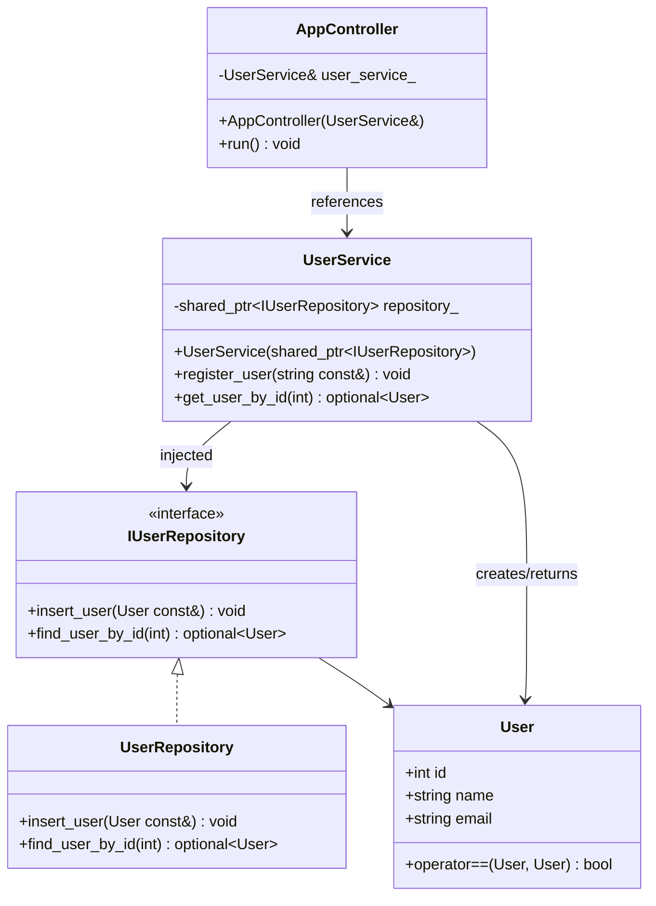
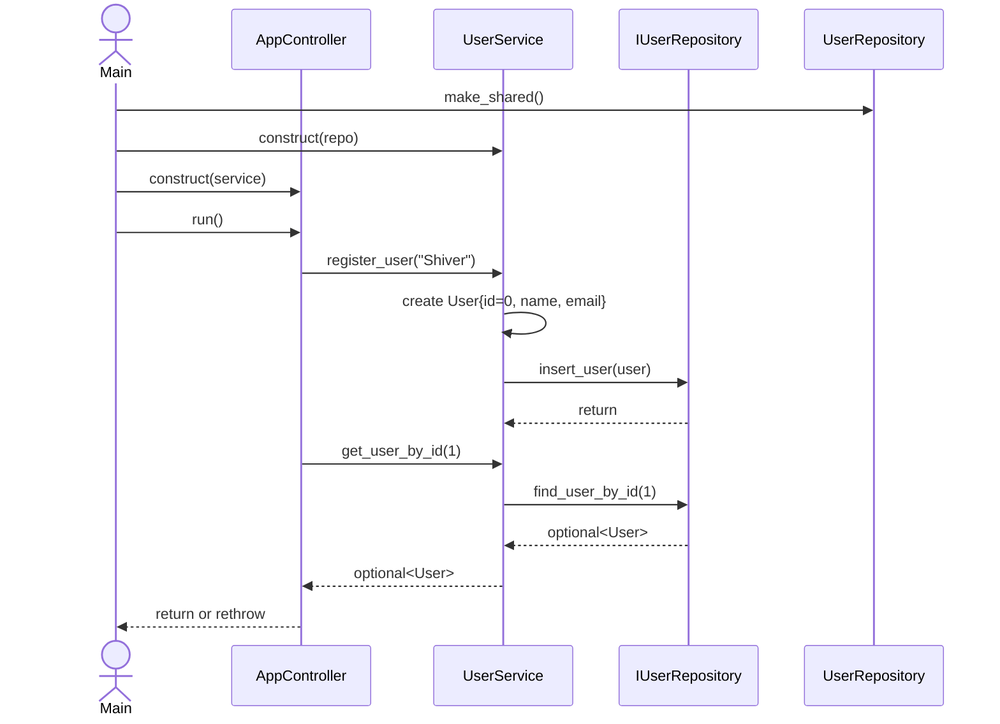

# sampleapp 詳細設計書

## 1. 文書情報

| 項目 | 内容 |
| --- | --- |
| 対象 | `sampleapp` モジュール |
| 目的 | `sampleapp` が満たすべき責務、公開契約、依存関係、エラー処理、テスト方針を定義する |
| 設計対象 | `sampleapp` のアーキテクチャ、コンポーネント責務、API契約、データフロー |
| 更新方針 | 要求または設計方針の変更時に本書を更新し、実装とテストを本書へ適合させる |

本書は `sampleapp` の実装が従うべき設計を定義する。実装やテストから設計を逆算するものではない。実装との差異は「実装状況と設計との差異」に記録し、設計変更として扱うか、実装を設計へ適合させるかを判断する。

## 2. 対象範囲

### 2.1 対象

- ユーザーエンティティ `sampleapp::User`
- ユーザー登録・検索ユースケース
- ユーザーリポジトリの抽象化と具象実装
- アプリケーション起動時の依存性注入と処理制御
- sampleapp のユニットテスト境界

### 2.2 対象外

- 実際の PostgreSQL 接続、スキーマ、トランザクション設計
- 認証・認可
- Web/API、画面 UI、並行実行
- ユーザー名・メールアドレスの業務バリデーション
- 永続化された ID の採番方式

`UserRepository` のコメントには PostgreSQL の記載があるが、現行実装は標準出力を使うダミー実装である。実データベース化は別の変更要求として設計・レビューする。

## 3. アーキテクチャ

sampleapp は次の3層構成とする。

| 層 | コンポーネント | 責務 | 依存先 |
| --- | --- | --- | --- |
| アプリケーション層 | `AppController` | 起動処理、ユースケースの順序制御、最上位のエラー伝播 | `UserService` |
| ビジネス層 | `UserService` | ユーザー登録・検索ユースケースの調整、ドメインデータ生成 | `IUserRepository` |
| データ層 | `UserRepository` | ユーザーの登録・検索。現状はダミー出力・固定応答 | なし |
| 契約 | `IUserRepository` | ビジネス層とデータ層の依存を分離 | `User` |
| ドメイン | `User` | ID、名前、メールアドレスを保持する値型 | 標準ライブラリ |

依存方向は上位層から下位層への一方向とし、`UserService` は `UserRepository` ではなく `IUserRepository` に依存する。実装時の具象クラス選択は `main.cpp` の構成ルートで行う。

## 4. コンポーネント詳細

### 4.1 `User`

**配置:** `include/sampleapp/User.hpp`

| 要素 | 型 | 契約 |
| --- | --- | --- |
| `id` | `int` | ユーザー識別子。登録時の入力は現状 `0` |
| `name` | `std::string` | ユーザー名 |
| `email` | `std::string` | メールアドレス |
| `operator==` | `bool` | `id`、`name`、`email` の全項目が一致した場合に `true` |

`User` はロジックを持たないデータモデルであり、ID の採番、入力検証、永続化を担当しない。

### 4.2 `IUserRepository`

**配置:** `include/sampleapp/interfaces/IUserRepository.hpp`

- 仮想デストラクタを持つインターフェース。
- `insert_user(const User&)` は登録要求を受け取る。
- `find_user_by_id(int)` は該当ユーザーを返し、存在しない場合は `std::nullopt` を返す。
- 例外型、DB 接続状態、SQL はインターフェースに露出しない。

### 4.3 `UserRepository`

**配置:** `include/sampleapp/UserRepository.hpp`, `src/sampleapp/UserRepository.cpp`

設計上の契約は次のとおり。

- `insert_user` はユーザーを登録し、登録処理の失敗は呼び出し側へ通知する。
- `find_user_by_id` は指定IDのユーザーを返し、存在しない場合は `std::nullopt` を返す。
- Repository はデータの保存方法や接続状態を呼び出し側へ露出しない。

### 4.4 `UserService`

**配置:** `include/sampleapp/UserService.hpp`, `src/sampleapp/UserService.cpp`

#### `register_user(name)`

1. 引数 `name` から `User` を生成する。
2. `id` は `0`、`email` は `name + "@example.com"` とする。
3. `IUserRepository::insert_user` を1回呼び出す。
4. 戻り値はない。

現行実装では空文字、メール形式、重複、名前の長さを検証しない。これらを追加する場合は要求、エラー契約、テストを同時に設計する。

#### `get_user_by_id(id)`

1. `IUserRepository::find_user_by_id(id)` を1回呼び出す。
2. 戻り値を変換せず、そのまま返す。
3. 該当なしは `std::nullopt` とする。
4. 現行実装では ID の正数チェックを行わない。

### 4.5 `AppController`

**配置:** `include/sampleapp/AppController.hpp`, `src/sampleapp/AppController.cpp`

- `UserService&` を非所有参照としてコンストラクター注入する。
- `run()` は登録、検索の順にサービスを呼び出す。
- 登録名と検索 ID は、呼び出し側から受け取った値を使用する。
- 例外を捕捉して標準エラー出力へ通知した後、同じ例外を再送出する。
- 検索結果は呼び出し側が利用できる形で受け取る。
- コントローラーはサービスやリポジトリの所有権を持たない。

#### 公開APIの共通契約

- `UserService` と `AppController` の依存性はコンストラクターで注入する。
- `UserService` に null の `std::shared_ptr` を渡した場合の明示的な拒否契約はなく、呼び出し時に不正アクセスとなる可能性がある。
- Repository からの例外は `UserService` が変換せずに伝播し、`AppController` は通知後に再送出する。
- 現行の公開メソッドはスレッドセーフ性を保証せず、並行実行を対象外とする。
- 登録は `void` を返し、生成したユーザーまたはIDを呼び出し側へ返さない。

## 5. 起動・依存性注入

`main.cpp` が構成ルートとして、コマンドライン引数を処理した後、次の順にオブジェクトを生成する。

1. `std::make_shared<UserRepository>()`
2. `UserService user_service(repo)`
3. `AppController controller(user_service)`
4. `controller.run()`

`UserService` は注入された `std::shared_ptr<IUserRepository>` を保持し、`AppController` は `UserService` を非所有参照する。所有関係は構成ルートで管理する。

CLIのアプリケーション名検証と、ユーザー登録に渡す入力値の関係は、アプリケーション要求で定義する。構成ルートは、Controller が必要とする入力を明示的に注入または提供する。

## 6. エラー・境界条件

| 状況 | 設計上の扱い | 確認事項 |
| --- | --- | --- |
| 検索対象なし | `std::nullopt` | 呼び出し側が未検出を扱う |
| `id <= 0` | 入力として許可するか拒否するかを要求で定義する | バリデーション層とエラー契約 |
| 空の名前 | 入力として許可するか拒否するかを要求で定義する | バリデーション層とエラー契約 |
| リポジトリ例外 | サービス境界まで伝播し、Controller が通知して再送出する | ドメイン例外への変換要否 |
| null の共有ポインター | 構成ミスとして生成時に拒否する | 例外型とテスト |
| ID の重複・採番 | Repository またはDBの責務として定義する | ID契約と永続化設計 |

新しい例外や戻り値を追加する変更は、`IUserRepository` の利用者、モック、受入条件まで影響するため、公開契約の変更として扱う。

## 7. テスト設計と対応

**現行テスト:** `test/unit/sampleapp/UserServiceTest.cpp`

| 対象 | テスト | 確認内容 |
| --- | --- | --- |
| `UserService::register_user` | `RegisterUserDelegatesToRepository` | 名前から生成した `User` の名前・メールを検証し、登録が1回呼ばれること |
| `UserService::get_user_by_id` | `FindUserReturnsExpectedUser` | ID をリポジトリへ渡し、取得した `User` を返すこと |
| `UserService::get_user_by_id` | `FindUserReturnsNulloptWhenNotFound` | 未検出時に `std::nullopt` を返すこと |
| `User::operator==` | `OperatorEqualReturnsFalseForDifferentUsers` | ID、名前、メール各項目の差異を検出すること |

`MockUserRepository` は `IUserRepository` の差し替え実装であり、サービスのユニットテストからデータ層を分離する。設計上の契約を変更した場合は、正常系・異常系・境界値・既存動作の回帰を同じテスト層で追加する。

次の振る舞いは現行テストで保証されていない。

- `AppController::run()` の登録・検索の呼び出し順
- Controller の標準エラー出力、例外再送出、検索結果の未使用
- `UserRepository` の標準出力、固定データ、登録結果を保持しない性質
- `main` のCLI引数処理、ヘルプ表示、終了コード
- null の依存性、リポジトリ例外、空文字や不正IDの扱い

これらは設計契約を実装へ反映する際に、該当するユニットテストまたはアプリケーションテストを追加する対象である。

## 8. ビルド構成

- 本体ライブラリ: `src/sampleapp/CMakeLists.txt` の `sampleapp`
- 実行ファイル: `src/CMakeLists.txt` の `main`
- テスト: `test/unit/sampleapp/CMakeLists.txt` の `sampleapp_tests`
- C++ 標準: C++17
- ソースとテストは `GLOB ... CONFIGURE_DEPENDS` で収集される。

## 9. 変更設計の進め方

変更設計では変更仕様を Requirement に分解し、次の観点で本書との対応を記録する。

1. 対象コンポーネントと公開契約の変更有無を特定する。
2. 依存方向、所有権、現行テストの保証範囲への影響を確認する。
3. 追加・変更・回帰テストを決める。
4. `impact-analysis.md`、`traceability.md`、`implementation-plan.md` で同じ Requirement ID を使用する。

### 9.1 変更影響の目安

| 変更箇所 | 典型的な影響 |
| --- | --- |
| `User` のフィールド・比較 | Service、Repository、モック、既存の値比較テスト |
| `IUserRepository` のメソッド | `UserService`、`UserRepository`、`MockUserRepository`、全呼び出し元 |
| `UserService` の入力・戻り値 | Controller、構成ルート、サービスの正常系・異常系テスト |
| `UserRepository` の永続化方式 | DB 設定、例外・トランザクション、統合テスト、運用設定 |
| `AppController::run` の処理順 | 起動時の観測結果、エラー伝播、アプリケーションテスト |
| CMake ターゲット・配置 | ビルド、テスト検出、カバレッジ対象 |

## 10. 未確定事項（Open Questions）

現行コードからは次の仕様を確定できない。変更仕様に関係する場合、Design Review 前に確認する。

- ユーザー ID は誰が採番し、登録後に呼び出し側へ返す必要があるか。
- 空文字・重複名・不正 ID・不正メールの正式な扱いは何か。
- リポジトリ障害をドメイン例外へ変換するか、そのまま伝播するか。
- `AppController` は検索結果を表示・返却すべきか。
- `UserService` のリポジトリ所有方式と、Controller の固定入力を継続するか。
- `UserRepository` を PostgreSQL 接続へ移行する予定と時期はあるか。

## 11. 実装状況と設計との差異

以下は現行実装の状態であり、設計上の契約とは区別する。差異を解消する場合は、要求と実装変更の要否を確認する。

- `UserRepository` は標準出力を使うダミー実装で、状態を保持しない。検索はIDが `1` の場合だけ固定ユーザーを返す。
- `AppController` は登録名 `Shiver` と検索ID `1` を固定し、検索結果をローカル変数に保持するだけで利用しない。
- `UserService` は null の共有ポインターを検証せず、名前からメールアドレスを生成する規則を実装内に持つ。
- `main.cpp` の `--name` は `myapp` との一致を検証するが、ユーザー登録名には渡されない。不正値は失敗終了し、`--help` は正常終了する。
- 現行テストは `UserService` の委譲と `User::operator==` が中心であり、Controller、Repository、`main` の契約を十分に検証していない。

これらは設計との差異または未検証範囲であり、変更要求がない限り本書だけで修正を要求しない。
